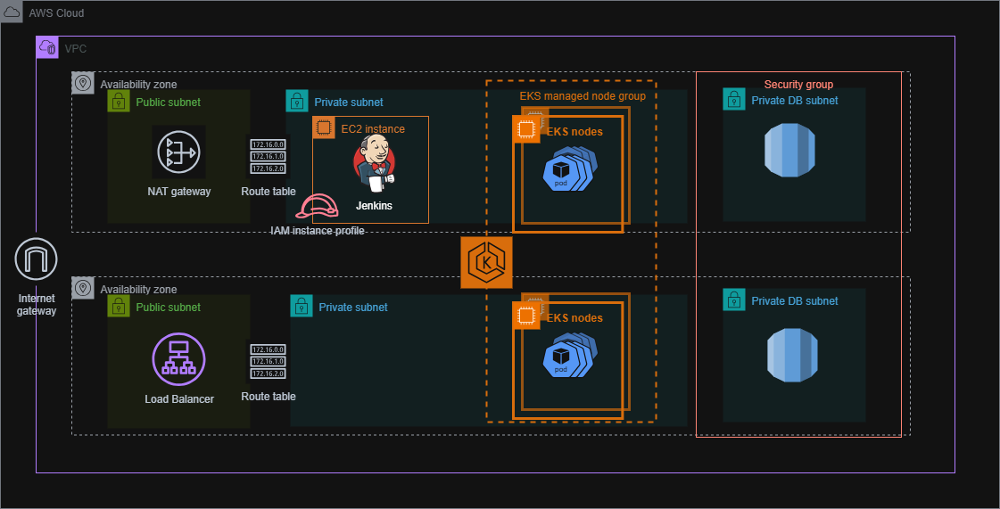
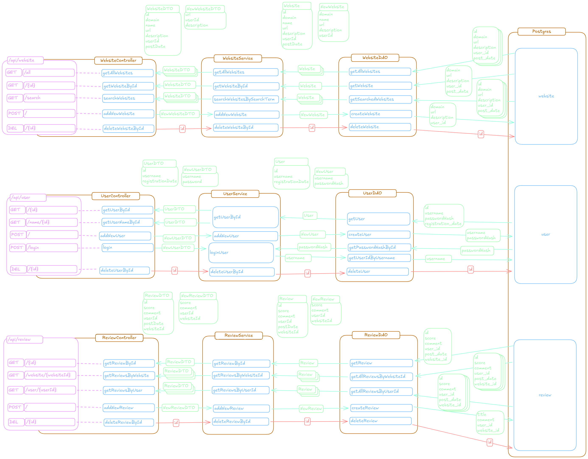

<a id="readme-top"></a>

<!-- PROJECT LOGO -->
<br />
<div align="center">
  <a href="https://github.com/szabodorka/netscore-aws">
    
  </a>

  <h3 align="center">NetScore</h3>

  <p align="center">
    A full-stack web application for rating and reviewing websites.
    <br />
    <strong>Still under active development</strong>
    <br />
    <br />
    <a href="#about-the-project"><strong>Explore the docs »</strong></a>
    <br />
    <a href="#tech-stack">Tech Stack</a> ·
    <a href="#infrastructure">Infrastructure</a> ·
    <a href="#how-to-deploy-on-aws">Deployment</a> ·
    <a href="#cleanup">Cleanup</a>
  </p>
</div>

---

## Table of Contents

1. [About the Project](#about-the-project)
2. [Tech Stack](#tech-stack)
3. [Infrastructure](#infrastructure)
4. [Collaboration](#collaboration)
5. [Prerequisites / Dependencies](#prerequisites)
6. [Local Development (Docker Compose)](#local-development)
7. [How to Deploy on AWS](#how-to-deploy-on-aws)
8. [Cleanup](#cleanup)
9. [Contributing](#contributing)

---

## About the Project

**NetScore** is a full-stack web application designed to allow users to **rate and review websites**.

Overview of the functionalities:

- Register and log in
- Add new websites (with automatic domain detection)
- Write, edit, and delete reviews
- View aggregated ratings and statistics
- Manage account and personal reviews

The platform is backed by an **AWS-based infrastructure** with a full CI/CD pipeline managed by **Jenkins**, running privately inside a VPN-secured EC2 instance.

The project is still **under active development** — features and infrastructure are developed continuously.

---

## Tech Stack

| Category                 | Technologies                                                                                                                                                                                                                                                                                              |
| ------------------------ | --------------------------------------------------------------------------------------------------------------------------------------------------------------------------------------------------------------------------------------------------------------------------------------------------------- |
| **Frontend**             | [](https://react.dev/) [](https://vitejs.dev/)                                                |
| **Backend**              | [](https://www.java.com/) [](https://spring.io/projects/spring-boot)               |
| **Database**             | [](https://www.postgresql.org/)                                                                                                                                                          |
| **Containerization**     | [](https://www.docker.com/) [](https://kubernetes.io/)                              |
| **CI/CD**                | [](https://www.jenkins.io/) [](https://github.com/features/actions) |
| **Cloud Infrastructure** | [](https://aws.amazon.com/) [](https://www.terraform.io/)                                 |
| **VPN & Security**       | [](https://openvpn.net/)                                                                                                                                                                          |

---

## Infrastructure

### AWS Architecture Overview

<p align="center">
  
</p>

### Backend Data Flow

<p align="center">
  
</p>

---

## Collaboration

### Branching Strategy

We use a feature-per-branch workflow. All feature branches (e.g. `feature/website-page`) are merged into development branches for the specific project components (e.g. `frontend`).

### Conventional Commits

We applied the following commit message format according to conventional commit methodology:

```bash
<type>(<optional scope>): <description>
```

Example commits:

- feat(website): implement domain extraction
- fix(model): change score type to int
- style(account): apply responsive design to MyAccount page

### Agile Development

Each feature is one sprint.  
Small, incremental merges into development branches, reviewed before merging to `main`.

---

## Prerequisites

Make sure you have installed:

- [Java 17+](https://adoptium.net/)
- [Node.js (v18+)](https://nodejs.org/)
- [Docker](https://www.docker.com/)
- [Terraform](https://www.terraform.io/)
- [AWS CLI](https://aws.amazon.com/cli/)
- [kubectl](https://kubernetes.io/docs/tasks/tools/)
- [OpenVPN](https://openvpn.net/) (for Jenkins access)

---

## Local Development

Start the stack locally using Docker Compose:

```bash
docker compose up --build
```

Access the application on http://localhost:80

Backend API: http://localhost:8080/api

To stop all containers:

```bash
docker compose down
```

## How to Deploy on AWS

**AWS access (CLI configured) is required.**

### Step 1 — Remote Backend Setup

Navigate to the terraform-backend directory:

```bash
cd terraform-backend
terraform init
terraform apply
```

This provisions:

- S3 bucket for Terraform state
- DynamoDB table for state locking

### Step 2 — Jenkins EBS Volume Setup

Navigate to the jenkins-ebs directory and apply:

```bash
terraform apply
```

This creates:

- EBS Volume
- IAM policies for Jenkins EC2 instance

### Step 3 — Deploy Core Infrastructure

```bash
cd infrastructure
terraform init
terraform apply
```

This provisions:

- VPC, subnets, IGW, NAT
- VPN
- EKS Cluster
- RDS PostgreSQL (Multi-AZ)
- Jenkins EC2 (in private subnet, VPN access required)
- ECR repositories for backend and frontend images
- Kubernetes deployments (backend and frontend pods) and ingress

## Cleanup

To completely remove all AWS resources, destroy in reverse order:

```bash
# Infrastructure (EKS, RDS, EC2, ECR, etc.)

cd infrastructure
terraform destroy

# Jenkins EBS Volume

cd ../jenkins-ebs
terraform destroy

# Remote Terraform Backend (S3, DynamoDB)

cd ../terraform-backend
terraform destroy
```

## Contributing

We really appreciate any suggestion that would make the project better. Feel free to fork the repo and create a pull request.
If you like the project, don't forget to give it a star! Thank you!

1. Fork the Project
2. Create your Feature Branch (`git checkout -b feature/new-feature`)
3. Commit your Changes (`git commit -m 'Add a new feature`)
4. Push to the Branch (`git push origin feature/new-feature`)
5. Open a Pull Request

### Top contributors:

<a href="https://github.com/szabodorka/netscore-aws/graphs/contributors">
  
</a>
